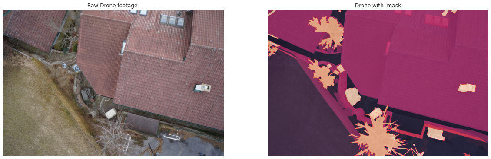
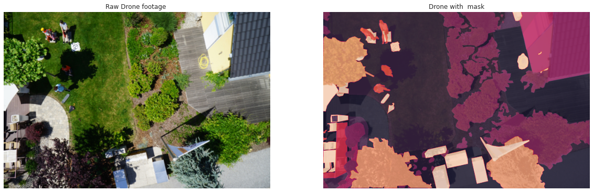
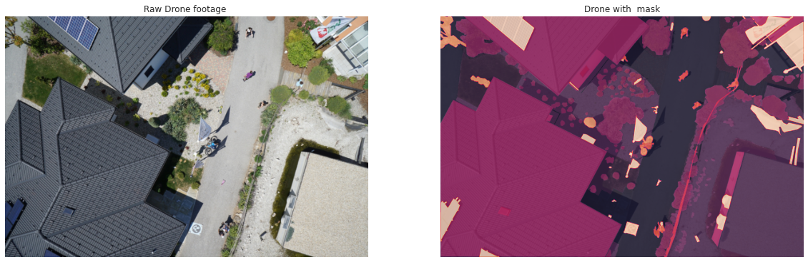
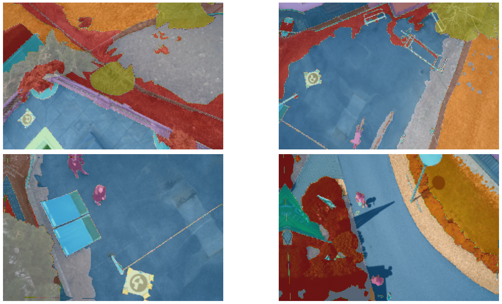
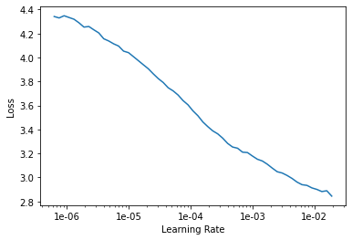
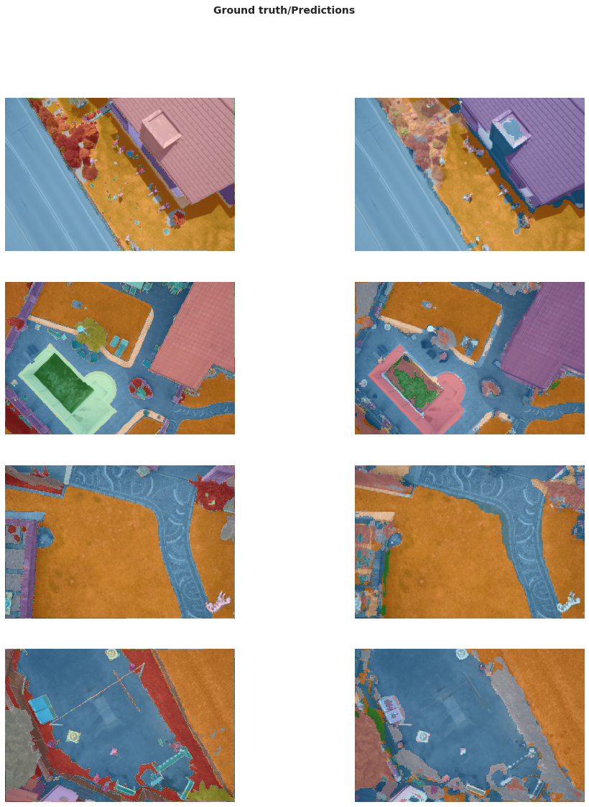
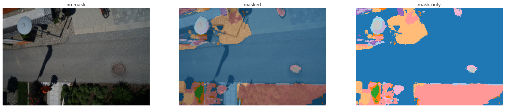
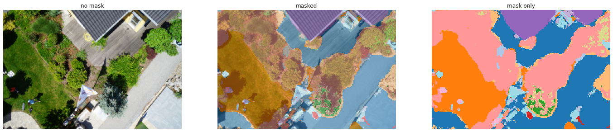
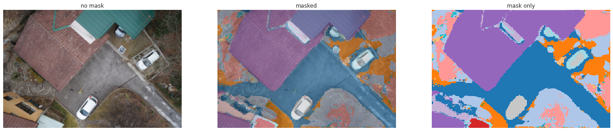

<center><h1> A Tutorial for Beginners. </h1></center>

***


<center><h2> On How to train A neural network for image Segmentation using Fast.ai and Transfer Learning</h2></center>


***

<center></center>


<center><h3> Please Upvote if you like it. </h3></center>

## What is semantic segmentation ?

* Source: **https://divamgupta.com/image-segmentation/2019/06/06/deep-learning-semantic-segmentation-keras.html**

* **Semantic image segmentation is the task of classifying each pixel in an image from a predefined set of classes.**

***

In the following example, different entities are classified.


***


In the above example, the pixels belonging to the bed are classified in the class “bed”, the pixels corresponding to the walls are labeled as “wall”, etc.

In particular, our goal is to take an image of size W x H x 3 and generate a W x H matrix containing the predicted class ID’s corresponding to all the pixels.

***


***

Usually, in an image with various entities, we want to know which pixel belongs to which entity, For example in an outdoor image, we can segment the sky, ground, trees, people, etc.

## Importing useful libraries


```python
from fastai import *
from fastai.vision import *
from fastai.callbacks.hooks import *
from fastai.callbacks import SaveModelCallback
import matplotlib.pyplot as plt
import seaborn as sns
import matplotlib.image as immg
import gc
import numpy as np
import random
from PIL import Image
import warnings
warnings.filterwarnings("ignore")
```


```python
open_image('../input/semantic-drone-dataset/semantic_drone_dataset/original_images/001.jpg').data.shape
```


    torch.Size([3, 4000, 6000])


## Path to the dataset
* Images were too big from original dataset So, resized them in 2 size
* > 1800x1200
* > 600x400


```python
path = Path('../input/drone-images-mask-resized/drone_data_small')  
```


```python
path.ls()
```


    [PosixPath('../input/drone-images-mask-resized/drone_data_small/label_small'),
     PosixPath('../input/drone-images-mask-resized/drone_data_small/train_small')]


```python
fnames = get_files(path/'train_small')
fnames_mask = get_files(path/'label_small')
```


```python
open_image(fnames[4]).data.shape
```


    torch.Size([3, 400, 600])


## Data PreProcessing


```python
from tqdm.notebook import tqdm,tnrange
```

* Since each pixel belongs to a diffrent class below function counts total number of such classes


```python
path_im = path/'train_small'
path_lb = path/'label_small'
get_y_fns = lambda x: path_lb/f'{x.stem}.png'       # Function to get masks for a image
```


```python
fnames[30],get_y_fns(fnames[30])
```


    (PosixPath('../input/drone-images-mask-resized/drone_data_small/train_small/554.jpg'),
     PosixPath('../input/drone-images-mask-resized/drone_data_small/label_small/554.png'))


```python
def get_classes(fnames):
    class_codes=[]
    for i in tqdm(range(400)):
        class_codes += list(np.unique(np.asarray(Image.open(get_y_fns(fnames[i])))))
    return np.array(list(set(class_codes)))
```


```python
# Run this once to get total classes if you want, other wise below cell gives total classes
codes = get_classes(fnames)  
```


    HBox(children=(FloatProgress(value=0.0, max=400.0), HTML(value='')))


    
    


```python
codes = np.array(codes)
codes
```


    array([ 0,  1,  2,  3,  4,  5,  6,  7,  8,  9, 10, 11, 12, 13, 14, 15, 16, 17, 18, 19, 20, 21, 22, 23, 24, 25],
          dtype=uint8)


```python
sns.set_style('darkgrid')
```

## Function to show chest X_ray with Mask


```python
def drone_mask(f):  # f = file_name
  img_a = immg.imread(f)
  img_a_mask = immg.imread(get_y_fns(f))
  plt.figure(1,figsize=(20,8))
  plt.subplot(121)
  plt.imshow(img_a);plt.title('Raw Drone footage ');plt.axis('off')
  plt.subplot(122)
  plt.imshow(img_a,alpha=0.8);
  plt.imshow(img_a_mask,alpha=0.8);plt.title('Drone with  mask');plt.axis('off')
  plt.show()
```

## A sample X-ray with Mask


```python
for i in range(3):
    img_num = random.randint(10,200)
    drone_mask(fnames[img_num])
```











## Creating A DatabLock for the model


```python
src=np.array([400,600])
#src=src//2
src
```


    array([400, 600])


```python
data = (SegmentationItemList.from_folder(path=path_im)  # Location from path
        .split_by_rand_pct(0.2)                          # Split for train and validation set
        .label_from_func(get_y_fns, classes=codes)      # Label from a above defined function
        .transform(get_transforms(), size=src, tfm_y=True)   # If you want to apply any image Transform
        .databunch(bs=4)                                   # Batch size  please decrese batch size if cuda out of memory
        .normalize(imagenet_stats))            # Normalise with imagenet stats
```


```python
data.show_batch(rows=2,figsize=(20,10));
```





```python
len(data.train_ds), len(data.valid_ds), data.c  
```


    (320, 80, 26)


# Model

* **Metrics for Drone mask**


```python
name2id = {v:k for k,v in enumerate(codes)}
void_code = -1

def drone_accuracy_mask(input, target):
    target = target.squeeze(1)
    mask = target != void_code
    return (input.argmax(dim=1)[mask]==target[mask]).float().mean()
```


```python
metrics = drone_accuracy_mask
wd=1e-2    # wd = weight decay
```

### Fastai's unet_learner
* Source [**Fast.ai**](www.fast.ai)

* This module builds a dynamic U-Net from any backbone **pretrained on ImageNet**, automatically inferring the intermediate sizes.


* **This is the original U-Net. The difference here is that the left part is a pretrained model.**

* **This U-Net will sit on top of an encoder ( that can be a pretrained model -- eg. resnet50 ) and with a final output of num_classes.**


```python
arch = models.resnet50
learn = unet_learner(data, # DatBunch
                     arch, # Backbone pretrained arch
                     metrics = [metrics], # metrics
                     wd = wd, bottle=True, # weight decay
                     model_dir = '/kaggle/working/') # model directory to save
```

    Downloading: "https://download.pytorch.org/models/resnet50-19c8e357.pth" to /root/.cache/torch/checkpoints/resnet50-19c8e357.pth
    


    HBox(children=(FloatProgress(value=0.0, max=102502400.0), HTML(value='')))


    
    

## Finding a suitable learning rate for our model

* With help fast.ai **learning rate finder** function


```python
callbacks = SaveModelCallback(learn, monitor = 'drone_accuracy_mask', every = 'improvement',mode='max', name = 'best_model' )
```


```python
learn.lr_find()
learn.recorder.plot()
```


    <div>
        <style>
            /* Turns off some styling */
            progress {
                /* gets rid of default border in Firefox and Opera. */
                border: none;
                /* Needs to be in here for Safari polyfill so background images work as expected. */
                background-size: auto;
            }
            .progress-bar-interrupted, .progress-bar-interrupted::-webkit-progress-bar {
                background: #F44336;
            }
        </style>
      <progress value='0' class='' max='2' style='width:300px; height:20px; vertical-align: middle;'></progress>
      0.00% [0/2 00:00<00:00]
    </div>

<table border="1" class="dataframe">
  <thead>
    <tr style="text-align: left;">
      <th>epoch</th>
      <th>train_loss</th>
      <th>valid_loss</th>
      <th>drone_accuracy_mask</th>
      <th>time</th>
    </tr>
  </thead>
  <tbody>
  </tbody>
</table><p>

    <div>
        <style>
            /* Turns off some styling */
            progress {
                /* gets rid of default border in Firefox and Opera. */
                border: none;
                /* Needs to be in here for Safari polyfill so background images work as expected. */
                background-size: auto;
            }
            .progress-bar-interrupted, .progress-bar-interrupted::-webkit-progress-bar {
                background: #F44336;
            }
        </style>
      <progress value='71' class='' max='80' style='width:300px; height:20px; vertical-align: middle;'></progress>
      88.75% [71/80 03:51<00:29 3.6654]
    </div>


    LR Finder is complete, type {learner_name}.recorder.plot() to see the graph.
    





```python
gc.collect() # to clear the cache
```


    6467


```python
lr = 1e-3           # Learning Rate
```


```python
learn.fit_one_cycle(10, slice(lr), pct_start = 0.8,callbacks = [callbacks] )
```


```python
learn.fit_one_cycle(10, slice(lr), pct_start = 0.8,callbacks = [callbacks] )
```


<table border="1" class="dataframe">
  <thead>
    <tr style="text-align: left;">
      <th>epoch</th>
      <th>train_loss</th>
      <th>valid_loss</th>
      <th>drone_accuracy_mask</th>
      <th>time</th>
    </tr>
  </thead>
  <tbody>
    <tr>
      <td>0</td>
      <td>2.106114</td>
      <td>1.835669</td>
      <td>0.483686</td>
      <td>00:16</td>
    </tr>
    <tr>
      <td>1</td>
      <td>1.697477</td>
      <td>1.331731</td>
      <td>0.618320</td>
      <td>00:12</td>
    </tr>
    <tr>
      <td>2</td>
      <td>1.462504</td>
      <td>1.227808</td>
      <td>0.659259</td>
      <td>00:13</td>
    </tr>
    <tr>
      <td>3</td>
      <td>1.455247</td>
      <td>1.147135</td>
      <td>0.691440</td>
      <td>00:12</td>
    </tr>
    <tr>
      <td>4</td>
      <td>1.336305</td>
      <td>1.115214</td>
      <td>0.691359</td>
      <td>00:12</td>
    </tr>
    <tr>
      <td>5</td>
      <td>1.247270</td>
      <td>1.168395</td>
      <td>0.669359</td>
      <td>00:12</td>
    </tr>
    <tr>
      <td>6</td>
      <td>1.310875</td>
      <td>1.181834</td>
      <td>0.672961</td>
      <td>00:13</td>
    </tr>
    <tr>
      <td>7</td>
      <td>1.196860</td>
      <td>1.115905</td>
      <td>0.698513</td>
      <td>00:12</td>
    </tr>
    <tr>
      <td>8</td>
      <td>1.131353</td>
      <td>0.888599</td>
      <td>0.748729</td>
      <td>00:12</td>
    </tr>
    <tr>
      <td>9</td>
      <td>0.983422</td>
      <td>0.799664</td>
      <td>0.771884</td>
      <td>00:12</td>
    </tr>
  </tbody>
</table>


    Better model found at epoch 0 with drone_accuracy_mask value: 0.4836856424808502.
    Better model found at epoch 1 with drone_accuracy_mask value: 0.6183198094367981.
    Better model found at epoch 2 with drone_accuracy_mask value: 0.6592585444450378.
    Better model found at epoch 3 with drone_accuracy_mask value: 0.691440224647522.
    Better model found at epoch 7 with drone_accuracy_mask value: 0.6985127329826355.
    Better model found at epoch 8 with drone_accuracy_mask value: 0.7487287521362305.
    Better model found at epoch 9 with drone_accuracy_mask value: 0.7718838453292847.
    

## To check results of our trained model


```python
learn.show_results(rows = 4, figsize=(16,18))
```





```python
learn.save('stage-1-big')  # saving the model 
```

## Export the model


```python
learn.export('/kaggle/working/drone_mask.pkl')
```

### Load the model  and predict

* **Function to make a prediction and Overlap the Drone Images with Predicted Drone Mask**


```python
def drone_predict(f):
    img = open_image(f).resize((3,200,300))
    mask = learn.predict(img)[0]
    _,axs = plt.subplots(1,3, figsize=(24,10))
    img.show(ax=axs[0], title='no mask')
    img.show(ax=axs[1], y=mask, title='masked')
    mask.show(ax=axs[2], title='mask only', alpha=1.)
```

### Prediction


```python
for i in range(3):
    n = random.randint(20,200)
    drone_predict(fnames[n])
```











## Model Summary


```python
print(learn.summary())
```

    DynamicUnet
    ======================================================================
    Layer (type)         Output Shape         Param #    Trainable 
    ======================================================================
    Conv2d               [64, 100, 150]       9,408      False     
    ______________________________________________________________________
    BatchNorm2d          [64, 100, 150]       128        True      
    ______________________________________________________________________
    ReLU                 [64, 100, 150]       0          False     
    ______________________________________________________________________
    MaxPool2d            [64, 50, 75]         0          False     
    ______________________________________________________________________
    Conv2d               [64, 50, 75]         36,864     False     
    ______________________________________________________________________
    BatchNorm2d          [64, 50, 75]         128        True      
    ______________________________________________________________________
    ReLU                 [64, 50, 75]         0          False     
    ______________________________________________________________________
    Conv2d               [64, 50, 75]         36,864     False     
    ______________________________________________________________________
    BatchNorm2d          [64, 50, 75]         128        True      
    ______________________________________________________________________
    Conv2d               [64, 50, 75]         36,864     False     
    ______________________________________________________________________
    BatchNorm2d          [64, 50, 75]         128        True      
    ______________________________________________________________________
    ReLU                 [64, 50, 75]         0          False     
    ______________________________________________________________________
    Conv2d               [64, 50, 75]         36,864     False     
    ______________________________________________________________________
    BatchNorm2d          [64, 50, 75]         128        True      
    ______________________________________________________________________
    Conv2d               [64, 50, 75]         36,864     False     
    ______________________________________________________________________
    BatchNorm2d          [64, 50, 75]         128        True      
    ______________________________________________________________________
    ReLU                 [64, 50, 75]         0          False     
    ______________________________________________________________________
    Conv2d               [64, 50, 75]         36,864     False     
    ______________________________________________________________________
    BatchNorm2d          [64, 50, 75]         128        True      
    ______________________________________________________________________
    Conv2d               [128, 25, 38]        73,728     False     
    ______________________________________________________________________
    BatchNorm2d          [128, 25, 38]        256        True      
    ______________________________________________________________________
    ReLU                 [128, 25, 38]        0          False     
    ______________________________________________________________________
    Conv2d               [128, 25, 38]        147,456    False     
    ______________________________________________________________________
    BatchNorm2d          [128, 25, 38]        256        True      
    ______________________________________________________________________
    Conv2d               [128, 25, 38]        8,192      False     
    ______________________________________________________________________
    BatchNorm2d          [128, 25, 38]        256        True      
    ______________________________________________________________________
    Conv2d               [128, 25, 38]        147,456    False     
    ______________________________________________________________________
    BatchNorm2d          [128, 25, 38]        256        True      
    ______________________________________________________________________
    ReLU                 [128, 25, 38]        0          False     
    ______________________________________________________________________
    Conv2d               [128, 25, 38]        147,456    False     
    ______________________________________________________________________
    BatchNorm2d          [128, 25, 38]        256        True      
    ______________________________________________________________________
    Conv2d               [128, 25, 38]        147,456    False     
    ______________________________________________________________________
    BatchNorm2d          [128, 25, 38]        256        True      
    ______________________________________________________________________
    ReLU                 [128, 25, 38]        0          False     
    ______________________________________________________________________
    Conv2d               [128, 25, 38]        147,456    False     
    ______________________________________________________________________
    BatchNorm2d          [128, 25, 38]        256        True      
    ______________________________________________________________________
    Conv2d               [128, 25, 38]        147,456    False     
    ______________________________________________________________________
    BatchNorm2d          [128, 25, 38]        256        True      
    ______________________________________________________________________
    ReLU                 [128, 25, 38]        0          False     
    ______________________________________________________________________
    Conv2d               [128, 25, 38]        147,456    False     
    ______________________________________________________________________
    BatchNorm2d          [128, 25, 38]        256        True      
    ______________________________________________________________________
    Conv2d               [256, 13, 19]        294,912    False     
    ______________________________________________________________________
    BatchNorm2d          [256, 13, 19]        512        True      
    ______________________________________________________________________
    ReLU                 [256, 13, 19]        0          False     
    ______________________________________________________________________
    Conv2d               [256, 13, 19]        589,824    False     
    ______________________________________________________________________
    BatchNorm2d          [256, 13, 19]        512        True      
    ______________________________________________________________________
    Conv2d               [256, 13, 19]        32,768     False     
    ______________________________________________________________________
    BatchNorm2d          [256, 13, 19]        512        True      
    ______________________________________________________________________
    Conv2d               [256, 13, 19]        589,824    False     
    ______________________________________________________________________
    BatchNorm2d          [256, 13, 19]        512        True      
    ______________________________________________________________________
    ReLU                 [256, 13, 19]        0          False     
    ______________________________________________________________________
    Conv2d               [256, 13, 19]        589,824    False     
    ______________________________________________________________________
    BatchNorm2d          [256, 13, 19]        512        True      
    ______________________________________________________________________
    Conv2d               [256, 13, 19]        589,824    False     
    ______________________________________________________________________
    BatchNorm2d          [256, 13, 19]        512        True      
    ______________________________________________________________________
    ReLU                 [256, 13, 19]        0          False     
    ______________________________________________________________________
    Conv2d               [256, 13, 19]        589,824    False     
    ______________________________________________________________________
    BatchNorm2d          [256, 13, 19]        512        True      
    ______________________________________________________________________
    Conv2d               [256, 13, 19]        589,824    False     
    ______________________________________________________________________
    BatchNorm2d          [256, 13, 19]        512        True      
    ______________________________________________________________________
    ReLU                 [256, 13, 19]        0          False     
    ______________________________________________________________________
    Conv2d               [256, 13, 19]        589,824    False     
    ______________________________________________________________________
    BatchNorm2d          [256, 13, 19]        512        True      
    ______________________________________________________________________
    Conv2d               [256, 13, 19]        589,824    False     
    ______________________________________________________________________
    BatchNorm2d          [256, 13, 19]        512        True      
    ______________________________________________________________________
    ReLU                 [256, 13, 19]        0          False     
    ______________________________________________________________________
    Conv2d               [256, 13, 19]        589,824    False     
    ______________________________________________________________________
    BatchNorm2d          [256, 13, 19]        512        True      
    ______________________________________________________________________
    Conv2d               [256, 13, 19]        589,824    False     
    ______________________________________________________________________
    BatchNorm2d          [256, 13, 19]        512        True      
    ______________________________________________________________________
    ReLU                 [256, 13, 19]        0          False     
    ______________________________________________________________________
    Conv2d               [256, 13, 19]        589,824    False     
    ______________________________________________________________________
    BatchNorm2d          [256, 13, 19]        512        True      
    ______________________________________________________________________
    Conv2d               [512, 7, 10]         1,179,648  False     
    ______________________________________________________________________
    BatchNorm2d          [512, 7, 10]         1,024      True      
    ______________________________________________________________________
    ReLU                 [512, 7, 10]         0          False     
    ______________________________________________________________________
    Conv2d               [512, 7, 10]         2,359,296  False     
    ______________________________________________________________________
    BatchNorm2d          [512, 7, 10]         1,024      True      
    ______________________________________________________________________
    Conv2d               [512, 7, 10]         131,072    False     
    ______________________________________________________________________
    BatchNorm2d          [512, 7, 10]         1,024      True      
    ______________________________________________________________________
    Conv2d               [512, 7, 10]         2,359,296  False     
    ______________________________________________________________________
    BatchNorm2d          [512, 7, 10]         1,024      True      
    ______________________________________________________________________
    ReLU                 [512, 7, 10]         0          False     
    ______________________________________________________________________
    Conv2d               [512, 7, 10]         2,359,296  False     
    ______________________________________________________________________
    BatchNorm2d          [512, 7, 10]         1,024      True      
    ______________________________________________________________________
    Conv2d               [512, 7, 10]         2,359,296  False     
    ______________________________________________________________________
    BatchNorm2d          [512, 7, 10]         1,024      True      
    ______________________________________________________________________
    ReLU                 [512, 7, 10]         0          False     
    ______________________________________________________________________
    Conv2d               [512, 7, 10]         2,359,296  False     
    ______________________________________________________________________
    BatchNorm2d          [512, 7, 10]         1,024      True      
    ______________________________________________________________________
    BatchNorm2d          [512, 7, 10]         1,024      True      
    ______________________________________________________________________
    ReLU                 [512, 7, 10]         0          False     
    ______________________________________________________________________
    Conv2d               [1024, 7, 10]        4,719,616  True      
    ______________________________________________________________________
    ReLU                 [1024, 7, 10]        0          False     
    ______________________________________________________________________
    Conv2d               [512, 7, 10]         4,719,104  True      
    ______________________________________________________________________
    ReLU                 [512, 7, 10]         0          False     
    ______________________________________________________________________
    Conv2d               [1024, 7, 10]        525,312    True      
    ______________________________________________________________________
    PixelShuffle         [256, 14, 20]        0          False     
    ______________________________________________________________________
    ReLU                 [1024, 7, 10]        0          False     
    ______________________________________________________________________
    BatchNorm2d          [256, 13, 19]        512        True      
    ______________________________________________________________________
    Conv2d               [512, 13, 19]        2,359,808  True      
    ______________________________________________________________________
    ReLU                 [512, 13, 19]        0          False     
    ______________________________________________________________________
    Conv2d               [512, 13, 19]        2,359,808  True      
    ______________________________________________________________________
    ReLU                 [512, 13, 19]        0          False     
    ______________________________________________________________________
    ReLU                 [512, 13, 19]        0          False     
    ______________________________________________________________________
    Conv2d               [1024, 13, 19]       525,312    True      
    ______________________________________________________________________
    PixelShuffle         [256, 26, 38]        0          False     
    ______________________________________________________________________
    ReLU                 [1024, 13, 19]       0          False     
    ______________________________________________________________________
    BatchNorm2d          [128, 25, 38]        256        True      
    ______________________________________________________________________
    Conv2d               [384, 25, 38]        1,327,488  True      
    ______________________________________________________________________
    ReLU                 [384, 25, 38]        0          False     
    ______________________________________________________________________
    Conv2d               [384, 25, 38]        1,327,488  True      
    ______________________________________________________________________
    ReLU                 [384, 25, 38]        0          False     
    ______________________________________________________________________
    ReLU                 [384, 25, 38]        0          False     
    ______________________________________________________________________
    Conv2d               [768, 25, 38]        295,680    True      
    ______________________________________________________________________
    PixelShuffle         [192, 50, 76]        0          False     
    ______________________________________________________________________
    ReLU                 [768, 25, 38]        0          False     
    ______________________________________________________________________
    BatchNorm2d          [64, 50, 75]         128        True      
    ______________________________________________________________________
    Conv2d               [256, 50, 75]        590,080    True      
    ______________________________________________________________________
    ReLU                 [256, 50, 75]        0          False     
    ______________________________________________________________________
    Conv2d               [256, 50, 75]        590,080    True      
    ______________________________________________________________________
    ReLU                 [256, 50, 75]        0          False     
    ______________________________________________________________________
    ReLU                 [256, 50, 75]        0          False     
    ______________________________________________________________________
    Conv2d               [512, 50, 75]        131,584    True      
    ______________________________________________________________________
    PixelShuffle         [128, 100, 150]      0          False     
    ______________________________________________________________________
    ReLU                 [512, 50, 75]        0          False     
    ______________________________________________________________________
    BatchNorm2d          [64, 100, 150]       128        True      
    ______________________________________________________________________
    Conv2d               [96, 100, 150]       165,984    True      
    ______________________________________________________________________
    ReLU                 [96, 100, 150]       0          False     
    ______________________________________________________________________
    Conv2d               [96, 100, 150]       83,040     True      
    ______________________________________________________________________
    ReLU                 [96, 100, 150]       0          False     
    ______________________________________________________________________
    ReLU                 [192, 100, 150]      0          False     
    ______________________________________________________________________
    Conv2d               [384, 100, 150]      37,248     True      
    ______________________________________________________________________
    PixelShuffle         [96, 200, 300]       0          False     
    ______________________________________________________________________
    ReLU                 [384, 100, 150]      0          False     
    ______________________________________________________________________
    MergeLayer           [99, 200, 300]       0          False     
    ______________________________________________________________________
    Conv2d               [49, 200, 300]       43,708     True      
    ______________________________________________________________________
    ReLU                 [49, 200, 300]       0          False     
    ______________________________________________________________________
    Conv2d               [99, 200, 300]       43,758     True      
    ______________________________________________________________________
    ReLU                 [99, 200, 300]       0          False     
    ______________________________________________________________________
    MergeLayer           [99, 200, 300]       0          False     
    ______________________________________________________________________
    Conv2d               [26, 200, 300]       2,600      True      
    ______________________________________________________________________
    
    Total params: 41,134,418
    Total trainable params: 19,866,770
    Total non-trainable params: 21,267,648
    Optimized with 'torch.optim.adam.Adam', betas=(0.9, 0.99)
    Using true weight decay as discussed in https://www.fast.ai/2018/07/02/adam-weight-decay/ 
    Loss function : FlattenedLoss
    ======================================================================
    Callbacks functions applied 
    
    


```python

```
